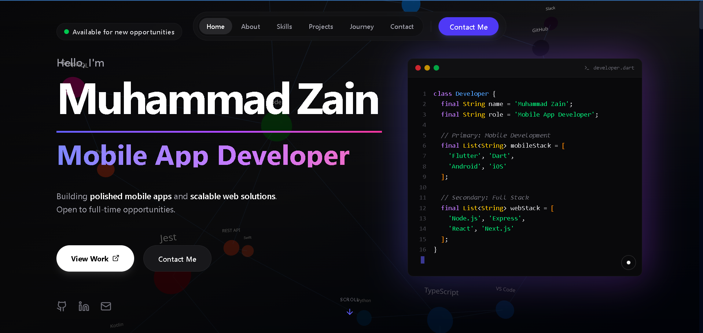
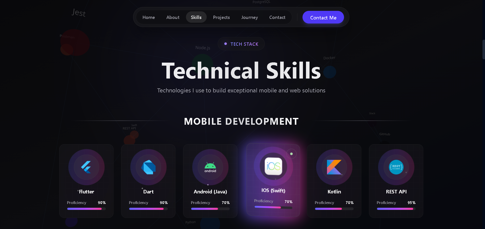
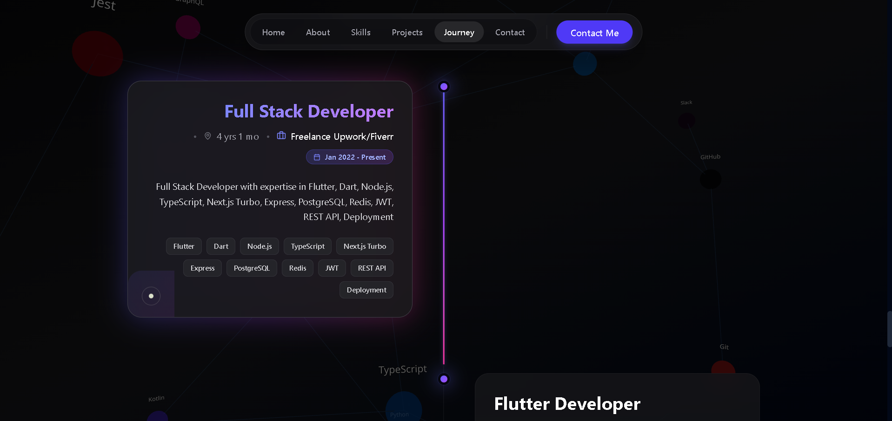
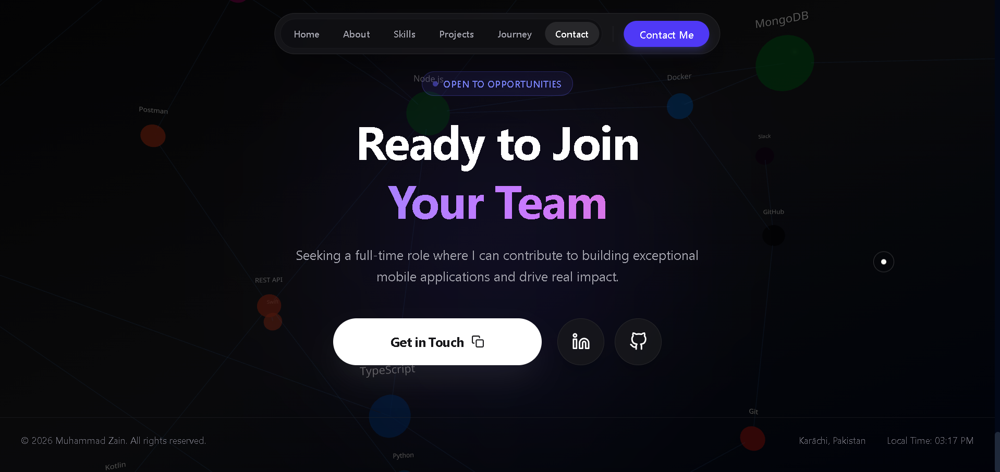

<div align="center">

# 🚀 Developer Portfolio Template

### A Modern, Interactive Portfolio for Developers

[](https://mzainsaeed7.github.io)
[](LICENSE)
[](https://github.com/mzainsaeed7/mzainsaeed7.github.io/stargazers)
[](https://github.com/mzainsaeed7/mzainsaeed7.github.io/network/members)


<br />

**Build your own stunning portfolio in minutes!**

A production-ready, fully customizable developer portfolio template with 3D animations, smooth transitions, and modern design.

[Get Started](#-quick-start) • [Customization](#️-customization) • [Deploy](#-deployment) • [Features](#-features)

</div>

---

## 📸 Screenshots

<div align="center">

| Hero Section | Skills Section |
|:---:|:---:|
|  |  |

| Journey Section | Contact Section |
|:---:|:---:|
|  |  |

</div>

---

## ✨ Features

| Feature | Description |
|---------|-------------|
| 🌌 **3D Interactive Background** | Force-directed graph that responds to mouse movement |
| 🎨 **Custom Magnetic Cursor** | Precision cursor with visual feedback on hover |
| ⚡ **Physics-Based Animations** | Floating 3D elements with collision physics |
| 📱 **Fully Responsive** | Optimized for mobile, tablet, and desktop |
| 🚀 **Lightning Fast** | Static generation for optimal performance |
| 🎭 **Smooth Scroll Animations** | Framer Motion-powered reveal effects |
| 🎯 **Single Config File** | Update all your info in ONE file |
| 🌙 **Modern Design** | Premium dark theme with gradient accents |
| 📧 **Contact Section** | Direct email, LinkedIn, and GitHub links |

---

## 📋 Prerequisites

Before you begin, ensure you have the following installed:

- **Node.js** 18.0 or higher → [Download](https://nodejs.org/)
- **npm** or **yarn** (comes with Node.js)
- **Git** → [Download](https://git-scm.com/)

Verify installation:
```bash
node --version    # Should be v18.0.0 or higher
npm --version     # Should be 9.0.0 or higher
git --version     # Any recent version
```

---

## 🚀 Quick Start

### 1. Use This Template

Click the **"Use this template"** button at the top of this repo, or:

```bash
# Clone the repository
git clone https://github.com/mzainsaeed7/mzainsaeed7.github.io.git my-portfolio

# Navigate to project
cd my-portfolio

# Install dependencies
npm install

# Start development server
npm run dev
```

### 2. Open in Browser

Navigate to [http://localhost:3000](http://localhost:3000)

---

## ⚙️ Customization

### Step 1: Update Your Information

**All personal data is in ONE file:** `src/lib/constants.ts`

```typescript
// ============= EDIT THIS FILE =============

export const PERSONAL_INFO = {
    name: "Your Name",                    // Your full name
    role: "Your Role",                    // e.g., "Frontend Developer"
    email: "your.email@example.com",      // Your email
    location: "Your City, Country",       // Your location
    bio: "Your bio goes here...",         // About you
    profileImage: "/your-photo.png",      // Add image to /public folder
    resumeUrl: "/resume.pdf",             // Add resume to /public folder
};

export const SOCIAL_LINKS = {
    github: "https://github.com/yourusername",
    linkedin: "https://linkedin.com/in/yourusername",
    email: "mailto:your.email@example.com",
};

export const SEO_CONFIG = {
    keywords: ["Your", "Keywords", "Here"],
};
```

### Step 2: Add Your Profile Picture

1. Add your photo to the `/public` folder (e.g., `photo.png`)
2. Update `PERSONAL_INFO.profileImage` in `constants.ts`

### Step 3: Update Your Projects

Edit `src/data/projects.ts`:

```typescript
export const projects = [
    {
        id: "project-1",
        title: "Your Project Name",
        description: "Short description",
        image: "/projects/project-image.png",
        technologies: ["React", "Node.js"],
        liveUrl: "https://your-project.com",
        githubUrl: "https://github.com/you/project",
    },
    // Add more projects...
];
```

### Step 4: Update Your Experience

Edit `src/data/experience.ts`:

```typescript
export const experiences = [
    {
        company: "Company Name",
        role: "Your Role",
        period: "Jan 2023 - Present",
        description: "What you did...",
        skills: ["Skill 1", "Skill 2"],
    },
    // Add more experiences...
];
```

### Step 5: Update Your Skills

Edit `src/data/skills.ts` with your tech stack.

---

## 📁 Project Structure

```
src/
├── app/                  # Next.js pages and layouts
├── components/
│   ├── layout/           # Navbar, Footer, Background
│   ├── sections/         # Hero, About, Skills, Projects, Contact
│   ├── three/            # 3D Canvas components
│   └── ui/               # Reusable UI components
├── data/                 # Your content (projects, skills, experience)
│   ├── projects.ts       # ← Edit your projects
│   ├── skills.ts         # ← Edit your skills
│   └── experience.ts     # ← Edit your experience
└── lib/
    └── constants.ts      # ⭐ Main config file - Edit this first!
```

---

## 🚀 Deployment

### Option 1: GitHub Pages (Free)

1. Push your code to GitHub
2. Go to **Settings → Pages**
3. Select **GitHub Actions** as source
4. Your site will be live at `https://yourusername.github.io`

### Option 2: Vercel (Recommended)

1. Import your repo at [vercel.com](https://vercel.com)
2. Click Deploy
3. Done! 🎉

### Option 3: Netlify

1. Connect your repo at [netlify.com](https://netlify.com)
2. Build command: `npm run build`
3. Publish directory: `out`

---

## 🛠️ Tech Stack

| Technology | Version | Purpose |
|------------|---------|---------|
| Next.js | 16.1 | React Framework (App Router) |
| React | 19.0 | UI Library |
| TypeScript | 5.x | Type Safety |
| Tailwind CSS | 4.0 | Styling |
| Framer Motion | 12.x | Animations |
| Three.js | 0.182 | 3D Graphics |
| React Three Fiber | 9.x | React + Three.js Integration |
| Lucide React | Latest | Icons |

---

## 🔧 Troubleshooting

### Build Fails?

```bash
# Delete cache and node_modules
rm -rf node_modules .next out

# Reinstall dependencies
npm install

# Try building again
npm run build
```

### Images Not Showing?

- ✅ Ensure images are in the `/public` folder
- ✅ Check file paths in config files (no `/public` prefix needed)
- ✅ Verify file extensions match exactly (case-sensitive)

### 3D Background Not Loading?

- ✅ WebGL must be enabled in your browser
- ✅ Try disabling browser extensions
- ✅ Update your graphics drivers

### Development Server Issues?

```bash
# Kill any running processes on port 3000
npx kill-port 3000

# Start fresh
npm run dev
```

---

## 📝 Customization Checklist

- [ ] Update `src/lib/constants.ts` with your info
- [ ] Add your profile picture to `/public`
- [ ] Update projects in `src/data/projects.ts`
- [ ] Update experience in `src/data/experience.ts`
- [ ] Update skills in `src/data/skills.ts`
- [ ] Add your resume to `/public/resume.pdf`
- [ ] Update favicon in `/public`
- [ ] Add screenshots to `docs/screenshots/`
- [ ] Deploy to your preferred platform

---

## 🤝 Contributing

Contributions are welcome! Feel free to:

1. Fork the repository
2. Create a feature branch (`git checkout -b feature/amazing-feature`)
3. Commit your changes (`git commit -m 'Add amazing feature'`)
4. Push to the branch (`git push origin feature/amazing-feature`)
5. Open a Pull Request

---

## 📄 License

This project is licensed under the **MIT License** - see the [LICENSE](LICENSE) file for details.

You are free to:
- ✅ Use commercially
- ✅ Modify
- ✅ Distribute
- ✅ Use privately

---

## ⭐ Support

If this template helped you, please consider:

- Giving it a ⭐ star on GitHub
- Sharing it with others
- [Following me](https://github.com/mzainsaeed7) for more projects

---

<div align="center">

**Built with ❤️ by [Muhammad Zain](https://github.com/mzainsaeed7)**

If you have any questions, feel free to reach out!

</div>
